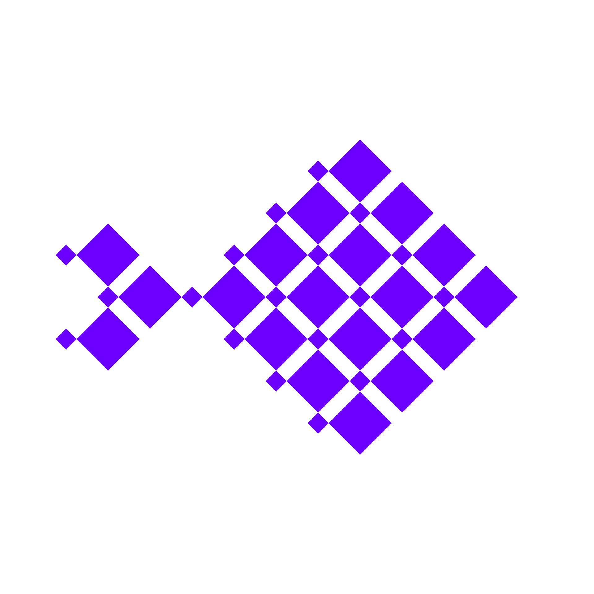

<p align="center">
  
</p>

# NemoFish

**A Korean-language public-opinion & scenario simulation engine.**

NemoFish is a Korean localization of [MiroFish](https://github.com/666ghj/MiroFish) (a swarm-intelligence
simulation engine), adapted for the Korean language and Korean population. Upload source material, describe
what you want to simulate, and a crowd of Korean-persona agents interacts on a virtual social platform so you
can read the resulting opinions, a generated report, and interview the agents afterward.

- ☁️ **Cloud LLM pipeline** — OpenAI `gpt-5.4-nano` for generation, Voyage AI for embeddings/reranking, all configured from `.env`
- 🕸️ **Zep Cloud → local GraphRAG** — knowledge graph memory replaced with a local SQLite store (`local_zep`)
- 🔎 **Background-material semantic search** — pick seed documents from a local text corpus (e.g. news/reports) via two-stage retrieval (Voyage embed → cosine → Voyage rerank)
- 🇰🇷 **Korean personas** — agents built from the statistically-grounded [NVIDIA Nemotron-Personas-Korea](https://huggingface.co/datasets/nvidia/Nemotron-Personas-Korea) dataset
- 💬 **Korean GUI** — interface fully localized to Korean (i18n: ko/en/zh)
- 🐳 **No Docker** — just conda environments + `python run.py`
- 🧩 **Optional local LLM** — the launcher can also serve Qwen3.6-27B locally via vLLM instead of a cloud API

---

## Acknowledgments

This project is built on top of:

- **[MiroFish](https://github.com/666ghj/MiroFish)** — the original swarm-intelligence simulation engine
  (AGPL-3.0). NemoFish is a modification of MiroFish for Korean use.
- **[NVIDIA Nemotron-Personas-Korea](https://huggingface.co/datasets/nvidia/Nemotron-Personas-Korea)**
  — a synthetic persona dataset grounded in Korean demographics (CC BY 4.0), used for agent persona generation.
- **[OASIS](https://github.com/camel-ai/oasis)** (camel-ai) — the social-media simulation framework.
- **[OpenAI](https://platform.openai.com/)** and **[Voyage AI](https://www.voyageai.com/)** — the cloud LLM and embedding/reranking providers.

---

## Requirements

**Cloud mode (default):**
- An **OpenAI API key** (LLM) and a **Voyage AI API key** (embeddings + reranking)
- `conda` (miniconda / anaconda) and `git`
- Node.js 20+ (installed into the conda env below; required by Vite)
- No GPU required

**Optional local LLM mode:** an NVIDIA GPU with large VRAM (tested on Blackwell / RTX PRO 6000, CUDA 12.8+)
to serve Qwen3.6-27B-FP8 via vLLM instead of the cloud LLM.

---

## Installation

### 1) Clone
```bash
git clone https://github.com/taeyoung-ko/NemoFish.git
cd NemoFish
```

### 2) Backend / dataset environment (`nemofish`)
```bash
conda create -n nemofish python=3.12 -y
conda activate nemofish
pip install -U uv

# Backend deps
uv pip install -r repo/backend/requirements.txt
uv pip install datasets huggingface_hub hf_transfer pandas pyarrow tiktoken

# Node 20+ for the frontend (required by Vite)
conda install -c conda-forge "nodejs>=20" -y

# Patch OASIS (drop MBTI + inject Nemotron demographics into agent prompts)
python scripts/patch_oasis.py

# (Optional but recommended) Pre-download & preprocess the Nemotron dataset into a
# local pool, so simulations sample instantly without streaming from HuggingFace.
python scripts/prepare_nemotron.py            # default 20,000 personas
# python scripts/prepare_nemotron.py --size 50000
```
> Without the Nemotron pre-download it still works (falls back to streaming from HuggingFace), just slower and requires network.

### 3) Frontend deps
```bash
cd repo/frontend && npm install && cd ../..
```

### 4) Environment variables
```bash
cp repo/.env.example repo/.env
```
Edit `repo/.env` for the cloud stack:
```env
# LLM: OpenAI
LLM_API_KEY=sk-...
LLM_BASE_URL=https://api.openai.com/v1
LLM_MODEL_NAME=gpt-5.4-nano

# Embeddings + reranking: Voyage AI
GRAPH_EMBED_PROVIDER=voyage
GRAPH_RERANK_PROVIDER=voyage
VOYAGE_API_KEY=pa-...
VOYAGE_EMBED_MODEL=voyage-4-lite
VOYAGE_RERANK_MODEL=rerank-2.5-lite

# Local GraphRAG (Zep replacement) — value is kept for format only
ZEP_API_KEY=local

# Korean personas
USE_NEMOTRON_PERSONAS=true
NEMOTRON_AGENT_COUNT=20

# OpenAI rate-limit pacing — set to your org's tokens-per-minute (TPM) limit.
# Main process + simulation subprocesses share this budget to avoid 429s.
OPENAI_TPM=200000
OASIS_LLM_CONCURRENCY=8

# (Optional) background-material semantic search corpus — a directory of .txt articles
# DESIGNDB_ROOT=/path/to/text/corpus
```
> To use a **local Qwen** LLM instead of OpenAI, point `LLM_BASE_URL` at your vLLM server
> (`http://localhost:8000/v1`) and `LLM_MODEL_NAME` at the served model, and create the optional
> `qwen36` env (`conda create -n qwen36 python=3.12 && uv pip install "vllm>=0.19" --torch-backend=auto`).

---

## Running

```bash
conda activate nemofish
python run.py --no-qwen        # cloud mode: launches backend + frontend only
```

`run.py` launches the backend (`:5001`, `nemofish` env) and the frontend GUI (`:3000`).
Without `--no-qwen` it additionally tries to serve a local Qwen3.6-27B model on `:8000` (local LLM mode).

When ready, open **http://localhost:3000** in your browser.
Press **Ctrl+C** in the launcher terminal to stop everything.

Options:
```bash
python run.py --no-qwen     # don't touch a local Qwen server (cloud mode / self-managed)
python run.py --skip-npm    # skip npm install
```

### (Optional) Build the background-material search index

If you set `DESIGNDB_ROOT` to a folder of `.txt` articles, build the semantic-search index once:
```bash
conda activate nemofish
python repo/backend/scripts/build_designdb_index.py
```
This embeds the corpus with Voyage into `repo/backend/app/data/designdb_index/`, after which the
Home screen lets you search and select seed documents per uploaded material.

---

## Usage (GUI)

1. **Home** — upload source material (PDF/MD/TXT), enter a simulation prompt, optionally search & select
   background documents (semantic search over your corpus), set the number of agents → **Start Engine**
2. **Graph Build** — document → ontology → knowledge graph (automatic)
3. **Env Setup** — sample Korean personas from Nemotron + configure the simulation
4. **Simulation** — agents interact on a virtual social platform (Twitter/Reddit-style, dual world)
5. **Report / Deep Interaction** — generated report + chat with agents and send **surveys** (batch interviews)

> For a first run, use a short document with a small number of rounds/agents.
> Large simulations make many LLM calls; NemoFish paces them under your OpenAI TPM limit (see `OPENAI_TPM`).

---

## Layout

```
NemoFish/
├─ run.py                     # unified launcher (backend + frontend, optional local Qwen)
├─ scripts/patch_oasis.py     # OASIS library patch (auto-applied by run.py, or run manually)
└─ repo/                      # the MiroFish app (localized fork)
   ├─ backend/                #   Flask backend
   │  ├─ scripts/build_designdb_index.py   # background-material search index builder
   │  └─ app/
   │     ├─ local_zep/        #   local GraphRAG replacing Zep (SQLite) + Voyage embed/rerank
   │     ├─ api/designdb.py   #   background-material search API
   │     ├─ services/designdb_search.py    # two-stage semantic search
   │     └─ utils/
   │        ├─ tpm_bucket.py       # cross-process OpenAI TPM budget (429 avoidance)
   │        └─ openai_throttle.py  # OpenAI request pacing
   ├─ frontend/               #   Vue 3 GUI (Korean)
   └─ locales/                #   i18n (ko/en/zh)
```

## License

The original MiroFish is AGPL-3.0, so this repository follows the same license.
Nemotron-Personas-Korea is CC BY 4.0.
